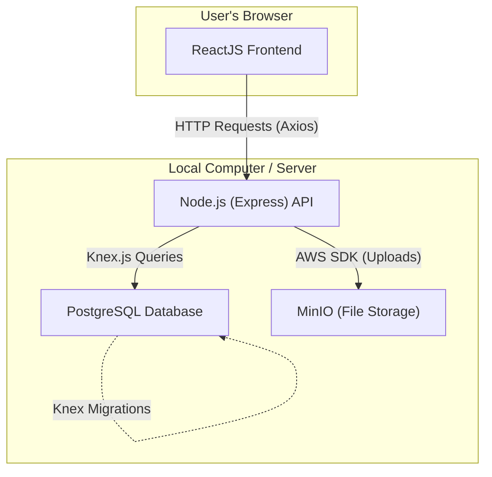

## Project Overview you’re building, who it’s for, and why.

**Your Requirements*i want this game to be called "betterMe" the theme will be very coquette and girly. i want there to be variouss sections of workouts. outfit inspo. and healthy skincare for you skin each in a few diffrent sections. {you can add more if you like} this game is meant for girls who like too workout or find trendy stuff for them self and maybe find some good skincare for them selfs. its to make girls more confident, and happy with what they are doing.

---

## Why Node.js & ReactJS?

- **Node.js + Express (Backend):** A lightweight, fast, and unopinionated runtime for building web APIs.

  - **One Language:** You use JavaScript (or TypeScript) for both the frontend and backend. This is the biggest advantage for beginners—you only need to learn one syntax.
  - **Huge Community:** If you get stuck, there is an NPM package or a StackOverflow answer for almost everything.
  - **JSON Native:** Since Node.js is JavaScript, working with JSON data (the standard for APIs) is seamless—no complex conversion logic required.
- **ReactJS (Frontend):** A library for building interactive user interfaces.

  - **Component-Based:** You build small "Lego blocks" (components) like a Button or a Navbar and assemble them into pages.
  - **Instant Feedback:** The tooling (Vite or Create React App) allows you to see your changes instantly in the browser as you code.

---

## Why PostgreSQL, Knex.js, & MinIO?

- **PostgreSQL:** The database. It acts as the "Excel sheet" where all your data (users, posts, comments) lives permanently. It is the industry standard for relational data.
- **Knex.js:** The "Liquibase equivalent" for Node.js.

  - **Migrations:** It allows you to create database tables using JavaScript code. It keeps a history of changes (version control). If you make a mistake, you can run a "rollback" command to undo the last change.
  - **Query Builder:** It helps you write safe SQL queries using JavaScript functions (e.g., `db('users').where('id', 1)` instead of raw SQL strings).
- **MinIO:** The "Hard Drive" for user uploads.

  - **S3 Compatible:** It works exactly like Amazon AWS S3 (the storage used by Netflix, Instagram, etc.), but you can run it for free on your own computer.
  - **Learning Opportunity:** It teaches the concept of "Object Storage" (storing files) vs. "Relational Database" (storing text/numbers).

---

## 1\. Tech Stack Architecture



- **Frontend**
  - React (initialized with `npm create vite@latest` for a faster setup than CRA)
  - Axios for sending requests to the backend
  - **State**: React Context API (built-in) or Zustand (easier for beginners than Redux)
- **Backend**
  - **Runtime**: Node.js
  - **Framework**: Express.js (handles the routing of URLs like `/login`, `/upload`)
  - **File Handling**: Multer (middleware to process image uploads)
- **Database**
  - PostgreSQL (running in Docker)
  - **Knex.js**: For migrations and talking to the DB.

---

## 2\. Local Development Setup

To make the Frontend talk to the Backend easily:

1. **Vite Proxy (Frontend)**

   - In `vite.config.js` (or `package.json` if using CRA), set up a proxy so the frontend knows where the backend lives.

   <!-- end list -->

   ```javascript
   // vite.config.js
   export default defineConfig({
     server: {
       proxy: {
         '/api': {
           target: 'http://localhost:5000', // The Node Backend Port
           changeOrigin: true,
         },
       },
     },
   });
   ```
2. **Backend Port**

   - Run the Node app on port `5000` to avoid conflict with React (usually `3000` or `5173`).

---

## 3\. Security (Simplified for Node)

### Frontend (React)

- **Storing Tokens**: When a user logs in, the backend sends a "Token" (like a digital wristband).
- **Where to put it**: For beginners, storing the token in `localStorage` is acceptable for learning projects. As she advances, move to `HttpOnly Cookies`.
- **Axios Setup**:
  ```javascript
  import axios from 'axios';

  const api = axios.create({
    baseURL: '/api', // Leverages the proxy
  });

  // Automatically add the token to every request if we have one
  api.interceptors.request.use((config) => {
    const token = localStorage.getItem('token');
    if (token) {
      config.headers.Authorization = `Bearer ${token}`;
    }
    return config;
  });

  export default api;
  ```

### Backend (Node/Express)

- **Passwords**: NEVER store plain text passwords. Use `bcryptjs` to hash them (scramble them) before saving to the DB.
- **JWT (Json Web Tokens)**: Use the `jsonwebtoken` library to create login tokens.
- **Protection**: Use `helmet` (a library that adds security headers automatically) and `cors` (to control who can talk to the server).

---

## 4\. Database & Migrations (Knex.js)

1. **Install Knex**: `npm install knex pg`
2. **Initialize**: `npx knex init` (Creates a `knexfile.js` config).
3. **Creating a Table**:
   Run `npx knex migrate:make create_users_table`. This creates a file in a `/migrations` folder.

   *Example Migration File:*

   ```javascript
   // The "Up" function creates the table
   exports.up = function(knex) {
     return knex.schema.createTable('users', function(table) {
       table.increments('id'); // Auto-incrementing ID
       table.string('username').notNullable();
       table.string('password').notNullable();
       table.timestamps(true, true); // Created_at and Updated_at
     });
   };

   // The "Down" function undoes the "Up" (Rollback)
   exports.down = function(knex) {
     return knex.schema.dropTable('users');
   };
   ```
4. **Run Migration**: `npx knex migrate:latest` (This applies the changes to Postgres).

---

## 5\. File Storage (Images)

We will use **MinIO** (S3 compatible) via Docker.

1. **Docker Compose**:

   ```yaml
   version: '3.8'
   services:
     db:
       image: postgres:latest
       ports:
         - "5432:5432"
       environment:
         POSTGRES_USER: user
         POSTGRES_PASSWORD: password
         POSTGRES_DB: myapp

     minio:
       image: minio/minio:latest
       ports:
         - "9000:9000"  # API port
         - "9001:9001"  # Console GUI port
       environment:
         MINIO_ROOT_USER: minioadmin
         MINIO_ROOT_PASSWORD: minioadmin
       command: server /data --console-address ":9001"
   ```
2. **Node.js Upload Logic**:

   - Library: `@aws-sdk/client-s3` (To talk to MinIO) and `multer` (To read file uploads from the frontend).
   - *Snippet:*

   <!-- end list -->

   ```javascript
   const { S3Client, PutObjectCommand } = require('@aws-sdk/client-s3');
   const multer = require('multer');

   // 1. Setup Client
   const s3 = new S3Client({
       region: 'us-east-1',
       endpoint: 'http://localhost:9000',
       forcePathStyle: true, // Needed for MinIO
       credentials: {
           accessKeyId: 'minioadmin',
           secretAccessKey: 'minioadmin'
       }
   });

   // 2. Setup Memory Storage (file is held in RAM briefly)
   const upload = multer({ storage: multer.memoryStorage() });

   // 3. Route
   app.post('/api/upload', upload.single('photo'), async (req, res) => {
       const params = {
           Bucket: 'my-bucket',
           Key: Date.now() + '-' + req.file.originalname, // Unique filename
           Body: req.file.buffer,
           ContentType: req.file.mimetype
       };

       await s3.send(new PutObjectCommand(params));
       res.send({ message: 'File uploaded!' });
   });
   ```

---

## 6\. Code Conventions

- **Variable Names**: Use `camelCase` (e.g., `userProfile`, `imageUpload`).
- **Async/Await**: Always use `async/await` for database calls instead of "callbacks". It makes code easier to read.
  ```javascript
  // GOOD
  const user = await db('users').where('id', 1);

  // BAD
  db('users').where('id', 1).then(user => { ... });
  ```
- **Logs**: Use `console.log` for debugging, but remove them before finishing the feature.

---

## 7\. README & Project Plan

1. **Setup Instructions**

   ```markdown
   # My Awesome App

   ## 1. Start Infrastructure
   docker-compose up -d

   ## 2. Start Backend
   cd backend
   npm install
   npx knex migrate:latest
   npm start

   ## 3. Start Frontend
   cd frontend
   npm install
   npm run dev
   ```
2. **Learning Plan**

   - [ ] **Week 1**: Build the Login page + Backend Route (Learn JWTs).
   - [ ] **Week 2**: Build the Database Schema (Knex Migrations).
   - [ ] **Week 3**: Image Upload functionality (MinIO + Multer).
   - [ ] **Week 4**: Connect the Frontend to display the images.

---

**Usage:** Copy this file into your project folder. It serves as your roadmap. Fill out the "Project Overview" and start checking off items in the Plan\!
